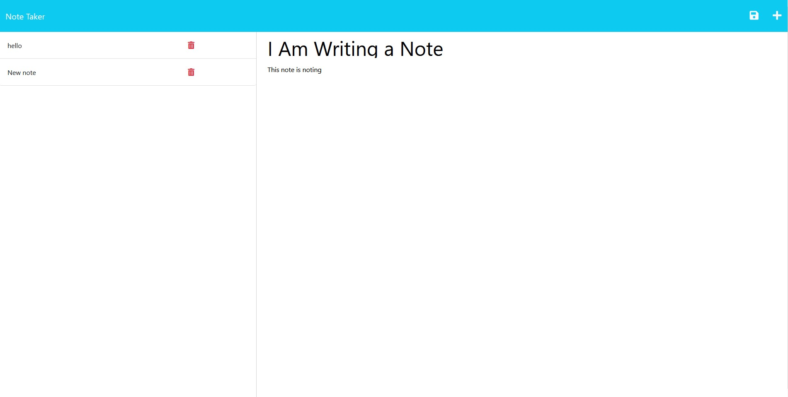
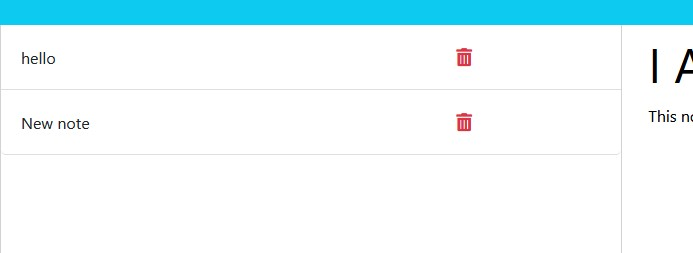

# NOTE ME

## Description
Note Me is an easy to use page that allows you to write and save notes which can be accessed for later. The site also allows you to title each note and deletion of notes you no longer need. 

[Click here to start taking notes!](https://note-me-but-ivans-version.herokuapp.com/)

## Table of Contents

- [Page Appearence](#pageappearance)

- [Usage](#usage)

- [Credits](#credits)

- [Features](#features)

- [License](#license)

## Page Appearance
Here are some screenshots detailing the site's appearance:

- Page Layout

- You can save and create new notes using these buttons in the top right corner

- The left sidebar allows you view saved notes and delete unwanted notes using the trashcan button

## Usage
To start writing a new note simply click the "+" icon in the top right of the page. This will create a new note which you can name inside of the first entry and add the body of the note inside the second entry. To save a note, users can click the save button next to the "+" icon in the top right. Once saved, you can click any note on the left-hand sidebar to view that note or click the trashcan icon to delete it.

## Features
- Create and save notes
- View saved notes
- Delete unwanted notes

## License
Licensed under the MIT License.

GitHub: [navidliwa](https://github.com/navidliwa)